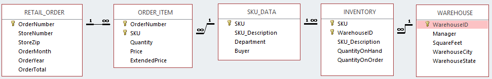

In part 2 were are focussing on the aggregate functions (COUNT, MAX, MIN, AVG, SUM) in combination with the GROUP BY. 


<h2> Connecting to the database </h2>

The first chunk in this Notebook will run automatically when you make the SQL statements. It loads the libraries you need and connects to the database 'CapeCodd.db' that should be in your folder. 

```{r setup, results='hide'}
library(tidyverse)
library(readxl)
library(DBI)

#enable other connections
# dbDisconnect(con)

# connect to CapeCodd
con <- DBI::dbConnect(RSQLite::SQLite(), "CapeCodd.db")
#

#
# use the database connection for all SQL chunks in this notebook and hide the code by default
knitr::opts_chunk$set(connection = "con", echo=FALSE)
```


<h2>Database design </h2>

Below is the design of the database. You should have this picture in the images folder of your workdirectory. You can open the picture next to your Notebook, so that you can see the design while creating your queries.




<h2> Assignments </h2>

Make a SQL query for the following questions. 

A. What is the total price per order (use ORDER_ITEM)?
```{sql, connection=con}
SELECT OrderNumber, SUM(Price)
FROM ORDER_ITEM
GROUP BY OrderNumber
```
<br>


B. What is the total price per order, for orders that have total quantity of items more than 2?
```{sql, connection=con}
SELECT OrderNumber, SUM(Price), Quantity
FROM ORDER_ITEM
WHERE Quantity > 2
GROUP BY OrderNumber;
```
<br>

C. What is the total price per order, for orders with more than 2 different items?
```{sql, connection=con}
SELECT Distinct OrderNumber, SUM(Price)
FROM ORDER_ITEM
GROUP BY OrderNumber;
```
<br>

E. For which SKU's the <b>average</b> QuantityOnHand is greater than the <b>highest</b> QuantityOnOrder for any Warehouse?
```{sql, connection=con}
SELECT SKU, AVG(QuantityOnHand), MAX(QuantityOnOrder)
FROM INVENTORY
GROUP BY SKU HAVING  AVG(QuantityOnHand) > MAX(QuantityOnOrder); 
```
Having = WHere ama za Group By KURVO
<br>

F. For which Warehouses the total QuantityOnHand is greater than the total QuantityOnOrder?
```{sql, connection=con}
SELECT WarehouseID, SUM(QuantityOnHand), SUM(QuantityOnOrder)
FROM INVENTORY
GROUP BY WarehouseID HAVING  SUM(QuantityOnHand) > SUM(QuantityOnOrder); 
```
<br>

G. For which Warehouses the total QuantityOnHand for Tents is greater than half the total QuantityOnOrder?
```{sql, connection=con}
SELECT WarehouseID, SUM(QuantityOnHand), SUM(QuantityOnOrder) / 2, SKU_Description
FROM INVENTORY
WHERE SKU_Description LIKE '%Tent%'
GROUP BY WarehouseID HAVING SUM(QuantityOnHand) > (SUM(QuantityOnOrder) / 2)
```
<br>

H.	Give the total quantity of all sku items in all the warehouses. Name the columns as sku, sku_description and QOH?
```{sql, connection=con}
SELECT SUM(SKU) as sku, SKU_Description as sku_description, QuantityOnHand as QOH
FROM INVENTORY
GROUP BY WarehouseID
```
<br>

<h2>Extra practice</h2>
<h3> GROUP BY, multiple columns</h3>

E1. How many items(SKU's) where ordered per price?
```{sql, connection=con}

```
<br>

E2.	How many different items(different SKU codes) are in the inventory per warehouse?
```{sql, connection=con}


```
<br>

E3.	How many different items(different SKU codes) are in the inventory for Warehouse 300?
```{sql, connection=con}


```
<br>
E4.	How many different items(different SKU codes) are in the inventory for Warehouse 300? But now, count only the items where the QuantityOnHand is higher than 50.
```{sql, connection=con}

```
<br>

E5.	How many items are there in total (use QuantityOnHand) in the inventory per warehouse?
```{sql, connection=con}


```

<h2> Challenging assignments</h2>


C1. Visualize the QuantityOnHand per SKU. Make two chunks: a sql chunk and a R chunk for <code> ggplot </code>

```{sql, connection = con, output.var = "df_result", echo=FALSE}


```
Remember to use the <code>{r}</code> tag in your chunk to switch to regular R again. 

```{r, echo=FALSE}

```
